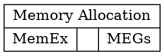

Workflow tasks reference is provided as [PDF file](/assets/docs/05-workflowtasksref/workflow_tasks.pdf).

**Note: following is a sandbox for testing out github compatibility**

## Memort Optimization

### Memory Allocation

$$
\begin{align*}
  & \phi(x,y) = \phi \left(\sum_{i=1}^n x_ie_i, \sum_{j=1}^n y_je_j \right)
  = \sum_{i=1}^n \sum_{j=1}^n x_i y_j \phi(e_i, e_j) = \\
  & (x_1, \ldots, x_n) \left( \begin{array}{ccc}
      \phi(e_1, e_1) & \cdots & \phi(e_1, e_n) \\
      \vdots & \ddots & \vdots \\
      \phi(e_n, e_1) & \cdots & \phi(e_n, e_n)
    \end{array} \right)
  \left( \begin{array}{c}
      y_1 \\
      \vdots \\
      y_n
    \end{array} \right)
\end{align*}
$$

| Value | Effect |
| --- | --- |
| $$n \in \mathbb{N}^*$$ | Number of random order. |

